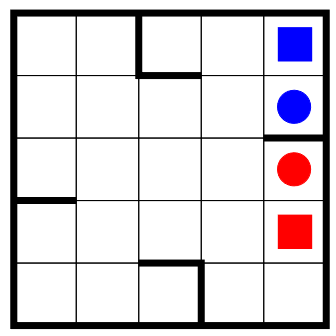

Tilting puzzle
==============

There is a board with a red and a blue ball on it, like in the picture. You can tilt the board in the four cardinal directions and both balls will roll in that direction all the way until they hit a wall. If the move would make the balls hit each other, it is invalid.

The goal of the game is to have the red ball on the red square and the blue ball on the blue square at the same time.

## Solution
1. UP
2. LEFT
3. UP
4. RIGHT
5. DOWN
6. RIGHT
7. UP
8. LEFT
9. UP
10. RIGHT

I have managed to clone the homework-project-2024 repository from GitHub initially instead of my own GitHub repo, so I've cloned the correct one and copied and pasted the changes. Here is a screenshot of the commits I've made in the other local repo.
